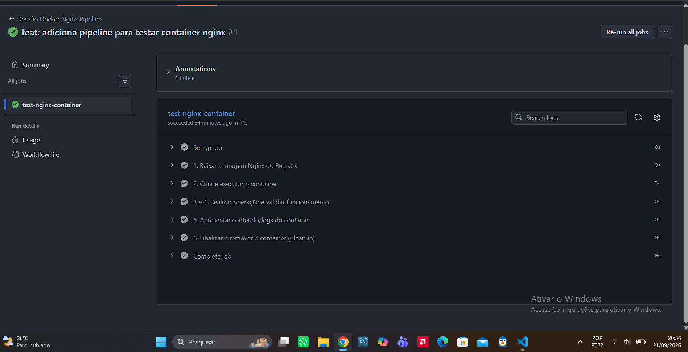

# Desafio Pipeline CI/CD - Docker Nginx

Este repositório contém a automação de uma pipeline CI/CD utilizando GitHub Actions para provisionar, validar e encerrar um container Docker do servidor web Nginx.

## Informações da Pipeline e Imagem

* **Origem da Imagem:** A imagem foi obtida do registry público [Docker Hub](https://hub.docker.com/_/nginx).
* **Imagem Escolhida:** `nginx:alpine`
* **Para que Serve:** O Nginx é um servidor HTTP e proxy reverso de alta performance. Nesta pipeline, ele é utilizado para subir um serviço web temporário de teste.
* **Container Criado:** `meu-nginx` (mapeado na porta `8080` do host para a porta `80` do container).

## Comandos Docker Utilizados

1. **`docker pull nginx:alpine`**: Baixa a imagem do Nginx leve (baseada em Alpine Linux) a partir do Docker Hub.
2. **`docker run -d --name meu-nginx -p 8080:80 nginx:alpine`**: Cria e executa o container em modo *detached* (background) mapeando as portas.
3. **`docker logs meu-nginx`**: Coleta os logs de execução e acessos do container para exibição no console do CI/CD.
4. **`docker stop meu-nginx`**: Encerra a execução do container de forma limpa.
5. **`docker rm meu-nginx`**: Remove o container do ambiente após a finalização do teste.

## Como a Pipeline Valida o Serviço

A validação ocorre de forma automática através dos seguintes passos no arquivo `.github/workflows/nginx-test.yml`:

1. A pipeline executa um comando `curl` fazendo uma requisição HTTP para `http://localhost:8080`.
2. Captura o código de status HTTP retornado pelo container.
3. Se o status retornado for **`200` (OK)**, a pipeline confirma que o servidor web está ativo e respondendo corretamente.
4. Caso o status seja diferente de 200, a pipeline encerra a execução com falha (`exit 1`).

## Evidência da Execução Bem-Sucedida

Abaixo está o comprovante de execução bem-sucedida da pipeline na aba **Actions** do GitHub:

